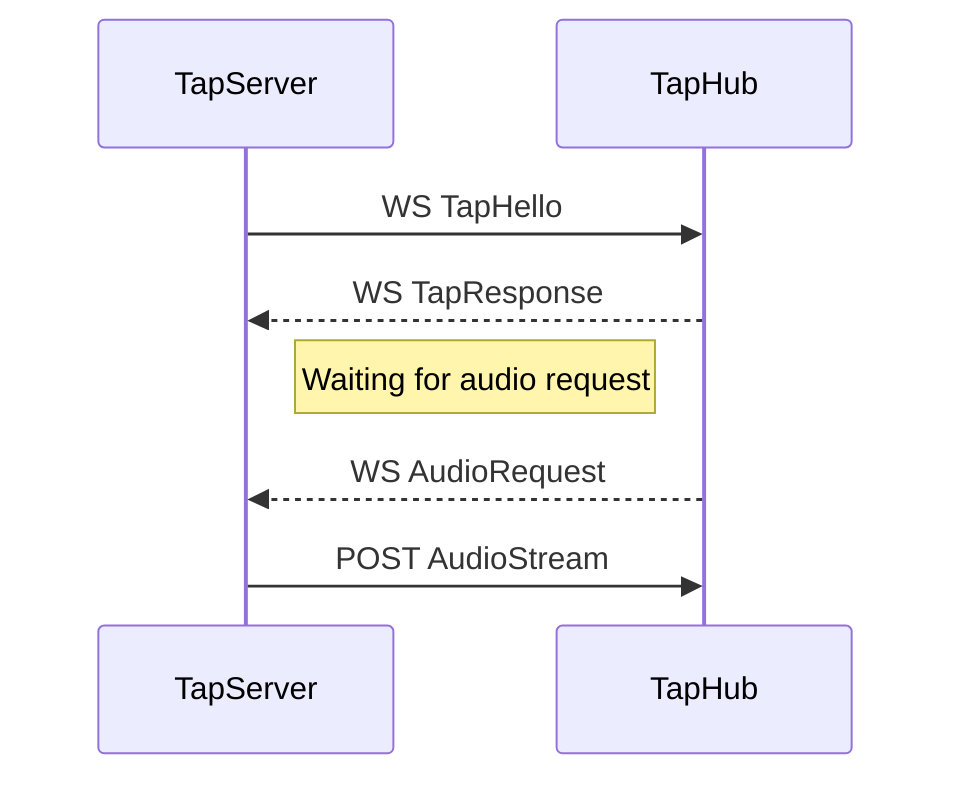

# Zako Tap SDK py

This is the python sdk package required to create a python tap server responsible for the audio of `zako`, a discord audio bot.

## Requirements

| package | version |
| --- | --- |
| eventemitter | 0.2.0 |
| requests | 2.32.4 |
| websockets | 15.0.1 |

## Quickstart Example

First, you need to download `tap-sdk-py` on your project.

```bash
pip install tap-sdk-py
```

Then, you can use the sdk.
Here is some example.

```py
import io
import asyncio
from zakotap import Client, ClientData, HelloResponse, AudioRequest

streamFile = io.BytesIO(b"test audio data")

clientData: ClientData = {
    "name": "your tap name",
    "token": "your tap token",
    "zakoEndpoint": "zako endpoint (default is https://api.zako.ac)"
}

client = Client(clientData)

def on_ready(data: HelloResponse):
    print("Client is ready. Connected Tab Hub version", data.get("version"))

def on_close(message: str):
    print("Connection closed:", message)

def on_warn(message: str):
    print("Warning:", message)

def on_error(message: str):
    print("Error:", message)

def on_audio_sync(audio_request: AudioRequest):
    print("Audio")
    loop = asyncio.get_event_loop()
    task = loop.create_task(on_audio(audio_request))

async def on_audio(audio_request: AudioRequest):
    print("Received audio request:", audio_request, flush = True)
    await client.send(audio_request.get("id"), streamFile)

client.on("warn", on_warn)
client.on("error", on_error)
client.on("ready", on_ready)
client.on("close", on_close)
client.on("audio", on_audio_sync)

client.connect()

```

## Client Description

### 1. Create Client and Connect

You can create tap server client by call `Client` class in `zakotap` package.

You should put the client data written as `ClientData` type inside the parentheses of `Client`.

You can then connect to the tab server using `client.connect()`.
```py
from zakotap import Client, ClientData

clientData: ClientData = {
    "name": "your tap server name",
    "token": "your tap server token",
    "zakoEndpoint": "zako tap hub endpoint (option)"
}

client = Client(clientData)

client.connect()
```

### 2. Client Event

Using the client created above, you can use client.on to perform a specific function when the EventEmitter's event is called.
```py
client.on("event name", function)
```
The types of events are specified in EmitterEvents among the types in the zakotap package.

#### Emitter Events

- `"ready"`: This event is called when the zako tap server successfully connects to the `zako tap hub`.
- `"close"`: This event is called when the `web socket` between the `zako tap server` and `tap hub` is closed.
- `"audio"`: This event is called when an `audio request` is received from the `zako tap hub`.
- `"warn"`: This event is called when a warning occurs within the zakotap package that should notify the developer.
- `"error"`: This event is called when an error occurs within the zakotap package.

### 3. Send Audio

You can send your audio stream by using `client.send()` function. You need to put `id` which you got from the `audio request` and then you can put your stream file. Also, you should use await to call this function. If not, `zakotap` package will call warn event to alert it.
```py
await client.send(audio_request.get("id"), "your audio stream")
```
If you don't send an audio stream, your tap server will be considered offline and you may be disconnected.

## Work Flow



## Related Documents
- [Zako 2]()
- [Protocol Specification]()

## Authors
- [@ridanit-ruma](https://github.com/ridanit-ruma) (Discord: `ruma0607`)
